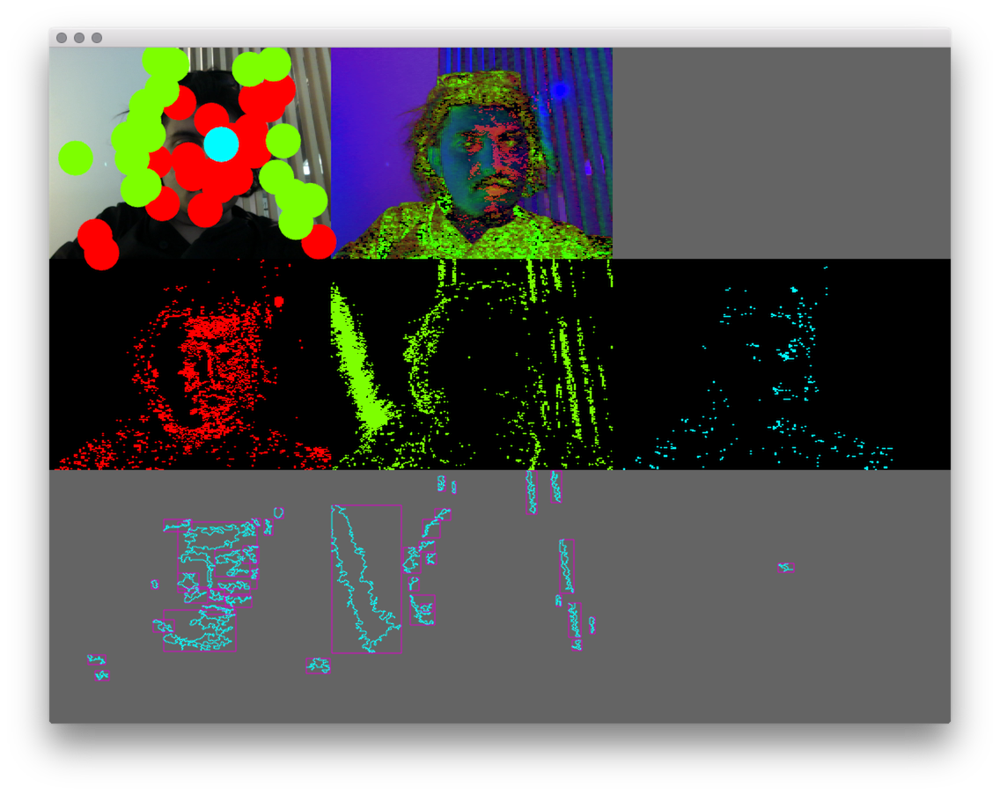

This presents a camera view, and you can click on a pixel to track those colors

It then sends those to a living room server over osc

Expects a roomdb osc server at localhost:41234

You can export `ROOMDB_HOST` and `ROOMDB_PORT` to change the location

